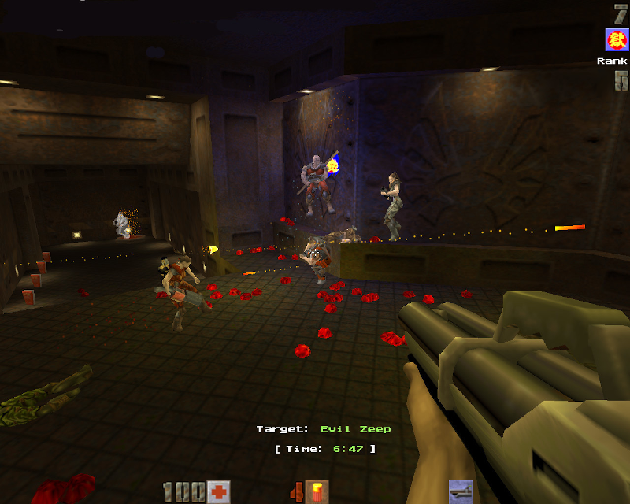
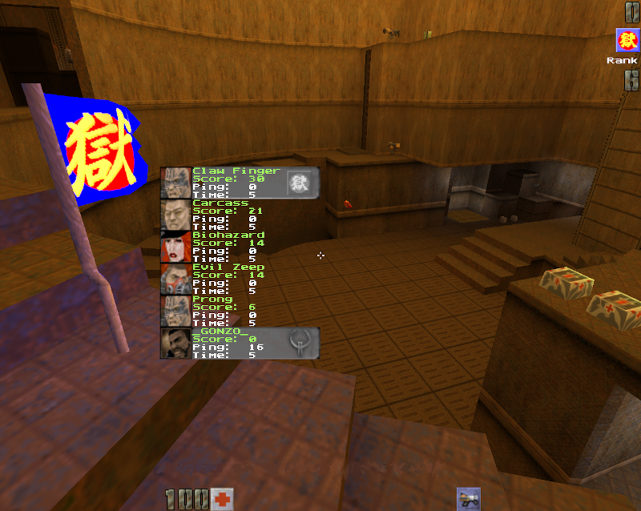

# 3zb2-zigflag

A custom port of the **3rd Zigock Bot II** mod for Quake II, with the **ZigFlag (Capture and Hold)** game mode, bugfixes, and enhancements from various sources including `tastyspleen`, `yquake2`, `OpenTDM`, and `OpenFFA`.

Originally built for nostalgia of the 90's Quake II deathmatch servers, this mod keeps the look and feel of the original game while adding a polished multiplayer experience with some of the best bots available for the Quake II engine.

> [Yamagi Quake II](https://github.com/yquake2/yquake2) is the recommended client. Also compatible with [vkQuake2](https://github.com/kondrak/vkQuake2) and [Q2Pro](https://github.com/q2pro/q2pro).

## Screenshots




## Features

### ZigFlag (Capture and Hold)

The premise is simple: **get the flag and keep it**. Plays on standard Deathmatch maps.

- Simple HUD enhancements with optional combat HUD, player identification, and rank/timer display
- Automatic bot control and autospawning at level start
- Visual and audio notifications for flag holders
- Customized dogtags on scoreboard
- Optional flag respawn, frag bonus, and health drain from subdued holders
- Optional auto weapon switching, respawn protection, and grapple
- Skin and model teams with bonuses/penalties on flag possession and friendly fire

### General

- `store` / `recall` commands to save and restore player position (_Jump mod style_)
- Remaining time display for all game modes
- Basic Team Deathmatch support (`set tdm 1`)
- Random player spawn points on map start
- Fixed menu item selection
- Improved aim (`aimfix`) - Quake 2 gameplay flaw fixes (`fixflaws`)

See [CONFIG.md](CONFIG.md) for full configuration details.

## Installation

1. Download the latest release from [Releases](https://github.com/DirtBagXon/3zb2-zigflag/releases).
2. Extract the mod files into your Quake II directory alongside other mods (e.g., `baseq2`, `ctf`).
3. Some features require assets from the base game:
   - **CTF / Grapple**: Copy `ctf/pak*.pak` into the `3zb2/` directory. Rename existing pak files to avoid conflicts (e.g., `pakX.pak`).
   - **Mission Pack 1 (Reckoning)**: Copy `xatrix/pak0.pak` into `3zb2/`.

### Quick Start

Place route chain files (`.chn`) in `3zb2/chdtm/` for bot navigation on your maps. Many popular maps are included. Additional routes can be created in-game via the `chedit` command (see [CONFIG.md](CONFIG.md)).

## Building from Source

### Prerequisites

```bash
# Arch / CachyOS
sudo pacman -S cmake gcc

# Cross-compilation (Windows targets)
sudo pacman -S \
    mingw-w64-tools \
    mingw-w64-binutils \
    mingw-w64-crt \
    mingw-w64-gcc \
    mingw-w64-headers \
    mingw-w64-winpthreads
paru -S \
    mingw-w64-zlib \
    mingw-w64-zlib-ng \
    mingw-w64-ffmpeg \
    mingw-w64-pkg-config \
    mingw-w64-libpng \
    mingw-w64-libjpeg-turbo \
    mingw-w64-openal \
    mingw-w64-zstd
```

### Compilation

Review build scripts before executing.  
Add `FORCE_OSTYPE=Windows_NT` to force an `OSTYPE`.

```bash
./build-lin64.sh

./clean.sh
./build-win32.sh

./clean.sh
./build-win64.sh FORCE_OSTYPE=Windows_NT
```

## Bot Commands

Use `exec addbot.cfg` to load predefined bot configurations. Bots can then be spawned with commands like `spawn1` or `despawn1`.

| Input | Action |
|-------|--------|
| `KP_PLUS` | Increase bot count |
| `KP_MINUS` | Decrease bot count |
| `KP_ENTER` | Spawn/remove bots |

Console commands:

```
sv spb $    # Spawn $ bots
sv rmb $    # Remove $ bots
```

## Common Configuration

Example server config for ZigFlag:

```
exec addbot.cfg
exec config-zflag.cfg
set zigmode 1
set zigspawn 1
set zigkiller 1
map q2dm1
```

## Known Issues

- The mod may lock up or segfault when using `gamemap`.  
  Use `map` (_full level reset_) instead. On Q2Pro, set `sv_allow_map 1` to allow this.
- Some models (_e.g. grappling hook_) are missing and require copying `pak` files from the `ctf` mod.

## Credits

- **Ponpoko** - Original 3rd Zigock Bot II mod author and bot creator
- Contributors and backport sources: tastyspleen, yquake2, OpenTDM, OpenFFA
- **MashedD** - Many thanks for the work and additions to this repo.

## License

Id Software Quake II Source Code License. See [LICENSE](LICENSE) for details.

